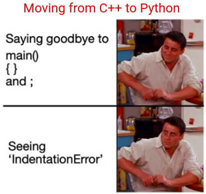

.. -*- coding: utf-8 -*-

.. _rcs_subversion:

Clase 14 - POO 2022
===================
(Fecha: 12 de mayo)

Registro en video de algunos temas de la clase de hoy
^^^^^^^^^^^^^^^^^^^^^^^^^^^^^^^^^^^^^^^^^^^^^^^^^^^^^

`Polimorfismo función virtual 2021 <https://youtu.be/wT_LfW-Ao0A>`_

`Función virtual pura clase abstracta 2021 <https://youtu.be/LjxmhcdzZbs>`_

Polimorfismo
============

- Lo utilizamos con punteros.
- Nos permite acceder a objetos de la clase derivada usando un puntero a la clase base.
- Sin embargo, sólo podemos acceder a datos y funciones que existan en la clase base.
- Los datos y funciones propias de la derivada quedan inaccesibles.

.. code-block:: c

	class Persona  {
	public:
	    Persona( QString nombre ) : nombre( nombre )  {  }
	    QString verNombre()  {  return "Nombre: " + nombre;  }

	protected:  // Para acceso desde las clases derivadas
	    QString nombre;
	};

	class Empleado : public Persona  {
	public:
	    Empleado( QString nombre ) : Persona( nombre )  {  }
	    QString verNombre()  {  return "Empleado: " + nombre;  }
	    void mostrarAlgo()  {  qDebug() << "Algo";  }
	};

	class Estudiante : public Persona  {
	public:
	    Estudiante( QString nombre ) : Persona( nombre )  {  }
	    QString verNombre()  {  return "Estudiante: " + nombre;  }
	};

	#include <QApplication>
	#include "personal.h"
	#include <QDebug>

	int main( int argc, char** argv )  {
	    QApplication a(argc, argv);

	    {
	    Persona * jose = new Estudiante( "Jose" );
	    Persona * carlos = new Empleado( "Carlos" );

	    qDebug() << carlos->verNombre();
	    qDebug() << jose->verNombre();
	    carlos->mostrarAlgo();  // Muestra algo? 

	    delete jose;
	    delete carlos;
	    }

	    return a.exec();
	}
	

Funciones virtuales
===================

- Puede ser interesante llamar a la función de la derivada (en polimorfismo).
- Al declarar una función como virtual en la clase base, si se superpone en la derivada, al invocar usando el puntero a la clase base, se ejecuta la versión de la derivada.

.. code-block:: c

	class Persona  {
	public:
	    Persona( QString nombre ) : nombre( nombre )  {  }
	    virtual QString verNombre()  {  return "Persona: " + nombre;  }  // Y si no fuera virtual?

	protected:  
	    QString nombre;
	};

	class Empleado : public Persona  {
	public:
	    Empleado( QString nombre ) : Persona( nombre )  {  }
	    QString verNombre()  {  return "Empleado: " + nombre;  }
	};

	#include <QApplication>
	#include "personal.h"
	#include <QDebug>

	int main( int argc, char** argv )  {
	    QApplication a( argc, argv) ;

	    {
	    Persona *carlos = new Empleado( "Carlos" );

	    qDebug() << carlos->verNombre();  // Qué publica?

	    delete carlos;
	    }

	    return a.exec();
	}

Función virtual pura y clase abstracta
======================================

- No necesita ser definida, sólo se declara.
- Será definida en las clases derivadas

.. code-block:: c

	virtual void verValor( int a ) = 0;

- Algunos pueden decir que no es muy elegante igualar a cero una función:

.. code-block:: c

	#define abstracta =0

	// entonces podemos usar:
	virtual void verValor( int a ) abstracta;

- Una clase con al menos una función virtual pura la convierte en clase abstracta.
- Una clase abstracta no puede ser instanciada.
- Si en la clase derivada no se define la función virtual pura, significa que esta clase derivada también es abstracta.

.. code-block:: c

	#define abstracta =0

	class Persona  {
	public:
	    Persona( QString nombre ) : nombre( nombre )  {  }
	    virtual QString verNombre() abstracta;

	protected:  
	    QString nombre;
	};

	class Empleado : public Persona  {
	public:
	    Empleado( QString nombre ) : Persona( nombre )  {  }
	    QString verNombre()  {  return "Empleado: " + nombre;  }
	};

	int main( int argc, char** argv )  {
	    QApplication a( argc, argv );

	    {
	    Persona * carlos = new Empleado( "Carlos" );

	    qDebug() << carlos->verNombre();

	    delete carlos;
	    }

	    return a.exec();
	}

Uso de Qt Designer
==================

- Nuevo proyecto -> Qt Widgets Application
- Utilizar el puntero ``ui`` para acceder a los objetos del diseño

**Ejemplo**

.. code-block:: c	
	
	// ventana.h
	#ifndef VENTANA_H
	#define VENTANA_H

	#include <QWidget>

	namespace Ui {
	    class Ventana;
	}

	class Ventana : public QWidget  {
	    Q_OBJECT

	public:
	    explicit Ventana( QWidget * parent = 0 );
	    ~Ventana();

	private:
	    Ui::Ventana *ui;
	};

	#endif // VENTANA_H

.. code-block:: c

	// ventana.cpp
	#include "ventana.h"
	#include "ui_ventana.h"

	Ventana::Ventana( QWidget * parent ) : QWidget( parent ), ui( new Ui::Ventana )  {
	    ui->setupUi( this );
	}

	Ventana::~Ventana()  {
	    delete ui;
	}

Métodos virtuales de QWidget para capturar eventos
^^^^^^^^^^^^^^^^^^^^^^^^^^^^^^^^^^^^^^^^^^^^^^^^^^

- Estos métodos pueden ser reimplementados en una clase derivada para recibir los eventos.

.. code-block:: c

	virtual void mouseDoubleClickEvent( QMouseEvent * event );
	virtual void mouseMoveEvent( QMouseEvent * event );
	virtual void mousePressEvent( QMouseEvent * event );
	virtual void mouseReleaseEvent( QMouseEvent * event );
	virtual void keyPressEvent( QKeyEvent * event );
	virtual void keyReleaseEvent( QKeyEvent * event );
	virtual void resizeEvent( QResizeEvent * event );
	virtual void moveEvent( QMoveEvent * event );
	virtual void closeEvent( QCloseEvent * event );
	virtual void hideEvent( QHideEvent * event );
	virtual void showEvent( QShowEvent * event );
	virtual void paintEvent( QPaintEvent * event );

Práctica Clase 14
=================

- Esta actividad correponde es un ejercicio en el cual se entrega el código fuente por Teams y tiene validez por el Ejercicio o Entregable de esta clase. Es de entrega obligatoria, lleva una nota de acuerdo a cómo haya sido resuelto y la fecha máxima de entrega es de una semana. En caso de no entregar, se deberá recuperar en la semana de recuperatorio.
- Crear una clase Barra para dar funcionalidad a una barra de progreso
- Que la barra tenga el siguiente aspecto:

- Debe tener métodos para setear su valor en porcentaje
- Usar la señal de ``downloadProgress`` de ``QNetworkReply``
- Crear una interfaz que tenga un ``QLineEdit`` para la URL y una Barra.
- Probarlo con alguna URL que pertenezca a un archivo de tamaño superior a 50MB

