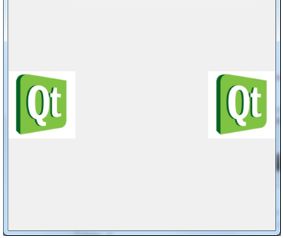

.. -*- coding: utf-8 -*-

.. _rcs_subversion:

Clase 19 - POO 2022
===================
(Fecha: 27 de mayo)

Registro en video de algunos temas de la clase de hoy
=====================================================

`const - https://youtu.be/UqXE4GeFd_s <https://youtu.be/UqXE4GeFd_s>`_ 

const
^^^^^

- Una variable definida como const no podrá ser modificada a lo largo del programa (se crea como sólo lectura)
- Se puede aplicar a cualquier tipo:

.. code-block:: c	

	const float pi = 3.14;
	const peso = 67;  // Si no se indica el tipo entonces es int
	                  // Aunque sólo en compiladores viejos

const con punteros
^^^^^^^^^^^^^^^^^^

.. code-block:: c	

	int x = 10;
	int * px = &x;  // normal

	const int y = 10;
	int * py = &y;  // El compilador dirá: "invalid conversion from const int*
	               // to int*". La inversa sí se permite

	int y = 10;
	const int * py = &y;  // permitido (pero el contenido es de sólo lectura)

	*py = 6;  // No permitido. El contenido apuntado es de sólo lectura

const en parámetros de funciones
^^^^^^^^^^^^^^^^^^^^^^^^^^^^^^^^

- Cuando los parámetros son punteros, decimos que no podrá modificar los objetos referenciados

.. code-block:: c	

	int funcion( const char * ch )

- Lo mismo sucede con referencias

.. code-block:: c	

	int funcion( const char& ch )

const en clases
^^^^^^^^^^^^^^^

.. code-block:: c	

	class ClaseA  {
	    const int i;
	    int x;

	public:
	    int funcion( ClaseA cA, const ClaseA &c )  {
	        cA.x = 1;
	        cA.i = 2;  // No compila. i es de sólo lectura.
	        c.x = 3;   // No compila. El objeto c es de sólo lectura.

	        return cA.x;
	    }
	}; 

.. code-block:: c	

	// A la variable i sólo la puede inicializar el constructor y sólo con la forma:
	ClaseA() : i( 8 )  {  }   

	// Si en el cuerpo del constructor se hace:
	ClaseA()  { 
	    i = 8;  // Compila? i es de solo lectura o no
	}   

- Aplicado a métodos de una clase no permite modificar ninguna propiedad de la clase

.. code-block:: c	

	class ClaseB  {
	    int x;

	    void funcion( int i ) const  {
	        x = x + i;  // Compila?
	    }
	};

Clase QFileDialog
^^^^^^^^^^^^^^^^^

- Permite abrir un cuadro de diálogo para buscar un archivo en disco

.. code-block:: c	

	QString file = QFileDialog::getOpenFileName( this, "Abrir", "./", "Imagen (*.png *.jpg)" );

Entregable Clase 19
===================

- Elegir un archivo de imagen del disco con ``QFileDialog`` y dibujar dos copias de esta imagen en un ``QWidget``.
- Deberá quedar como la siguiente figura:

 
- Al hacer click sobre una de estas dos imágenes, se deberá ocultar la imagen sobre la que si hizo click. 
- Cuando se hace click sobre la que quedó visible, se deberá hacerla rotar sobre su centro y que quede girando indefinidemente.

- Grabar con OBS mostrando cómo quedó.
- Para los que tienen proyecto final, pueden hacer este ejercicio o deberán explicar los avances del trabajo. Lo pueden grabar juntos o individualmente, pero cada uno me lo entrega por Teams individualmente.

